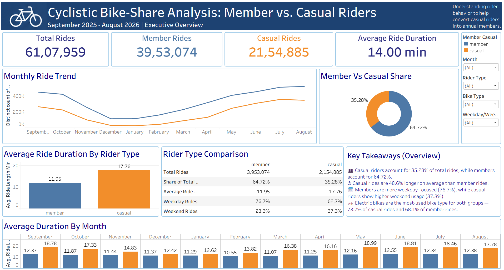

# Cyclistic Bike-Share Analysis

## Annual Members vs Casual Riders

### Project Overview

This project analyzes Cyclistic bike-share usage patterns to understand how annual members and casual riders use the service differently.

The analysis covers 12 months of Cyclistic trip data from September 2025 to August 2026, containing more than 6.1 million rides.

The project follows a complete data analyst workflow:

Data Quality Check → Data Cleaning → Data Preparation → Data Analysis → Tableau Dashboard → Findings & Recommendations

---

## Business Question

**How do annual members and casual riders use Cyclistic bikes differently?**

The objective is to identify differences in riding behavior between annual members and casual riders and use these insights to identify opportunities for increasing annual memberships.

---

## Interactive Dashboard

**Tableau Public:** [View Cyclistic Executive Overview](https://public.tableau.com/views/Cyclistic_17908287080820/CyclisticExecutiveOverview?:language=en-US&:sid=&:redirect=auth&:display_count=n&:origin=viz_share_link)

---

## Dataset

**Analysis Period:** September 2025 – August 2026

**Total Rides Analyzed:** 6,107,959

The dataset contains information including:

- Ride ID
- Rideable type
- Start and end timestamps
- Start and end stations
- Start and end coordinates
- Rider type
  - Member
  - Casual

The raw trip data is not included in this repository because of its size.

---

## Tools Used

| Tool | Purpose |
|---|---|
| Google BigQuery | Data quality checks, cleaning, preparation and analysis |
| SQL | Data exploration, transformation and analysis |
| Tableau Public | Interactive dashboard and visualization |
| CSV | Data export and Tableau data preparation |
| PowerPoint | Findings and recommendations presentation |
| GitHub | Project documentation and portfolio |

---

# SQL Analysis Workflow

The SQL analysis was organized into four stages.

## 1. Data Quality Check

The first stage focused on understanding the quality and structure of the raw datasets before making any changes.

Checks included:

- Row counts
- Duplicate ride IDs
- Missing values
- Date ranges
- Ride duration issues
- Zero or negative ride durations
- Rides longer than 24 hours
- Cross-month records
- Rider-type distribution
- Bike-type distribution
- Station data completeness

This stage helped identify potential data quality issues before cleaning and analysis.

---

## 2. Data Cleaning

The second stage focused on preparing reliable monthly datasets for analysis.

The cleaning process included:

- Removing invalid ride durations
- Removing rides longer than 24 hours
- Creating cleaned monthly tables
- Applying consistent data-quality rules across the 12 months
- Validating the cleaned results

The cleaned monthly datasets were then used for the next stage of the analysis.

---

## 3. Data Preparation for Analysis

The third stage combined and transformed the cleaned datasets into an analysis-ready dataset.

Additional fields were created for analysis, including:

- Ride length in minutes
- Month
- Month name
- Day of week
- Weekday/weekend classification
- Hour of day

The 12 monthly cleaned datasets were combined into a single dataset containing:

**6,107,959 unique rides**

---

## 4. Data Analysis

The final SQL stage focused on answering the business question.

The analysis compared annual members and casual riders across:

- Total ride volume
- Share of total rides
- Average ride duration
- Median ride duration
- Weekday vs weekend usage
- Day-of-week patterns
- Hourly usage
- Monthly trends
- Bike-type usage
- Start station usage
- End station usage
- Seasonal patterns

---

# Key Findings

## 1. Members account for the majority of rides

| Rider Type | Rides | Share |
|---|---:|---:|
| Members | 3,953,074 | 64.72% |
| Casual | 2,154,885 | 35.28% |
| Total | 6,107,959 | 100% |

Annual members account for nearly two-thirds of all rides during the study period.

---

## 2. Casual riders have longer rides

| Rider Type | Average Ride Duration | Median Ride Duration |
|---|---:|---:|
| Member | 11.95 min | 8.55 min |
| Casual | 17.76 min | 10.83 min |

Casual riders have a substantially longer average ride duration than members.

---

## 3. Members have a higher weekday usage share

### Member rides

- Weekday: 76.66%
- Weekend: 23.34%

### Casual rides

- Weekday: 62.75%
- Weekend: 37.25%

Casual riders have a larger proportion of weekend rides compared with members.

---

## 4. Weekly usage patterns differ

The most common day of the week differed between the two rider groups:

- Casual riders: Saturday — 21.14% of casual rides
- Members: Wednesday — 15.98% of member rides

This indicates different weekly usage patterns between the two groups.

---

## 5. Electric bikes are widely used by both groups

### Casual riders

- Electric: 73.74%
- Classic: 26.26%

### Members

- Electric: 68.07%
- Classic: 31.93%

Electric bikes account for the majority of rides for both rider groups.

---

## 6. Casual usage shows stronger seasonal variation

Casual riders represent a smaller share of total rides during the winter months and a larger share during warmer months.

The casual share ranged from approximately:

- 17.92% in January
- 41.13% in July

This indicates that casual usage is more seasonal than member usage.

---

## 7. Station usage patterns differ

Casual riders frequently use stations associated with waterfront and attraction areas.

Examples include:

- Navy Pier
- DuSable Lake Shore Dr & Monroe St
- Michigan Ave & Oak St

Member usage is more concentrated around downtown street locations such as:

- Canal St & Madison St
- State St & Chicago Ave

These differences provide additional context for understanding the behavior of the two rider groups.

---

# Tableau Dashboard

The final Tableau dashboard presents the main findings in an executive-style format.

The dashboard includes:

- Total rides KPI
- Member rides KPI
- Casual rides KPI
- Average ride duration
- Monthly ride trend
- Member vs casual ride share
- Average duration by rider type
- Rider comparison table
- Average duration by month
- Interactive filters
- Key takeaways

**View the interactive dashboard on Tableau Public:**

[View Cyclistic Executive Overview](https://public.tableau.com/views/Cyclistic_17908287080820/CyclisticExecutiveOverview?:language=en-US&:sid=&:redirect=auth&:display_count=n&:origin=viz_share_link)

### Dashboard Preview



---

# Presentation

A PowerPoint presentation summarizing the key findings, behavioral differences between members and casual riders, recommendations, and measurement approach.

[Download the Cyclistic Findings & Recommendations Presentation](presentation/Cyclistic_Findings_and_Recommendations.pptx)

---

# Recommendations

The analysis provides several areas that can be tested to increase annual membership conversion.

## 1. Target frequent casual riders with membership campaigns

Casual riders account for more than 2.1 million rides during the study period.

Cyclistic can identify frequent casual riders and test targeted membership offers designed to encourage conversion to annual membership.

## 2. Focus on weekend casual riders

Casual riders have a substantially higher weekend usage share than members.

Weekend usage can therefore be considered when designing membership messaging and promotional campaigns.

## 3. Use ride-duration behavior in membership messaging

Casual riders have an average ride duration of 17.76 minutes compared with 11.95 minutes for members.

Membership messaging can communicate the potential value of membership to casual riders who use the service regularly for longer trips.

## 4. Consider seasonal campaign timing

Casual usage increases substantially during warmer months.

Membership conversion campaigns can be tested during periods when casual ridership is higher.

## 5. Consider electric-bike usage

Electric bikes account for the majority of rides for both rider groups.

Electric-bike availability and usage can be incorporated into membership messaging where appropriate.

---

# Measuring the Recommendations

Future analysis can track:

- Casual-to-member conversion rate
- Membership sign-ups from campaigns
- Repeat casual riders
- Average rides per converted member
- Revenue per rider
- Monthly member growth
- Campaign conversion rate
- Electric-bike usage among members

A/B testing can be used to compare different membership offers and marketing messages.

---

# Repository Structure

```text
cyclistic-bike-share-analysis/
│
├── README.md
│
├── sql/
│   ├── 01_data_quality_check.sql
│   ├── 02_data_cleaning.sql
│   ├── 03_data_preparation.sql
│   └── 04_data_analysis.sql
│
├── dashboard/
│   └── cyclistic_dashboard.png
│
├── presentation/
│   └── Cyclistic_Findings_and_Recommendations.pptx
│
└── documentation/
    └── project_notes.md
